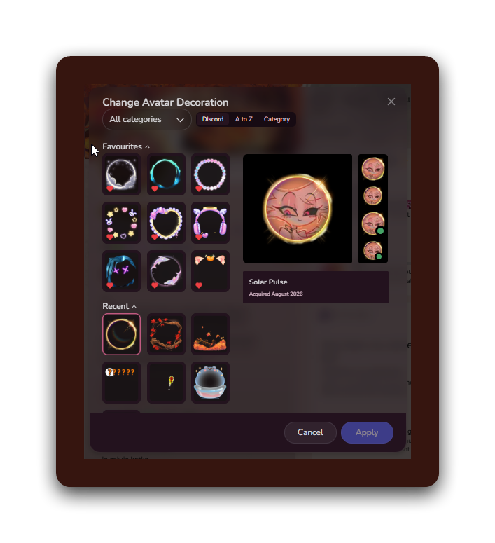
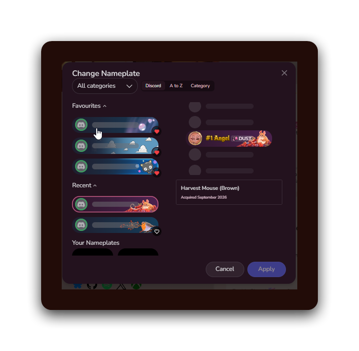
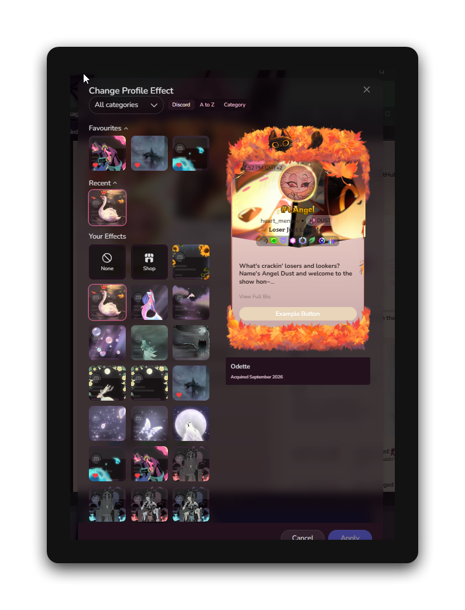
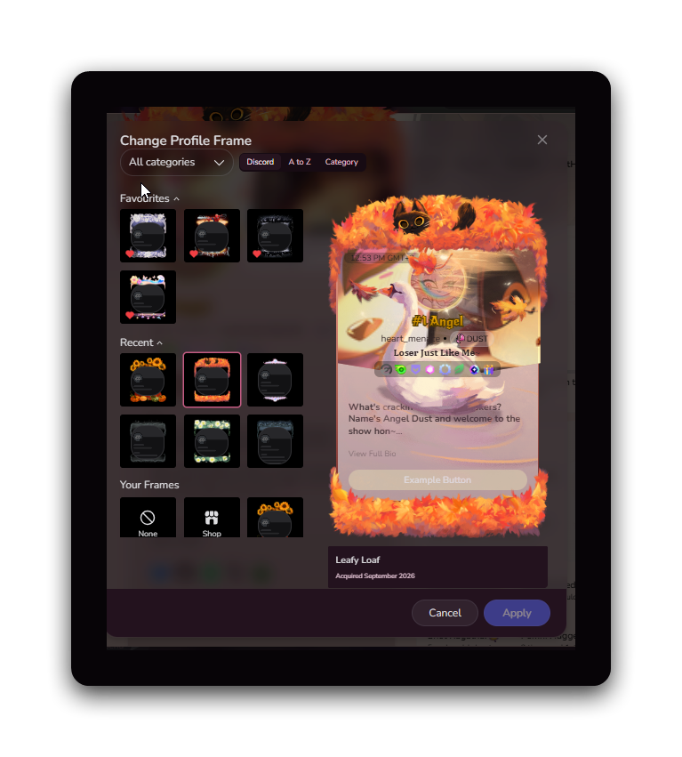

# CollectiblePickers

An Equicord userplugin for Discord's collectible pickers: nameplates, avatar decorations,
profile effects and profile frames.

- Favourite any collectible, and get a favourites row pinned above the grid.
- See the ones you used most recently, in their own row.
- Sort a picker alphabetically, or by category.
- Filter by category with a dropdown, listing the categories Discord actually has.

| | |
|---|---|
|  |  |
|  |  |

## Installing

Drop this folder into `src/userplugins/` in an Equicord dev build, run `pnpm build`, and
enable **CollectiblePickers** in settings.
